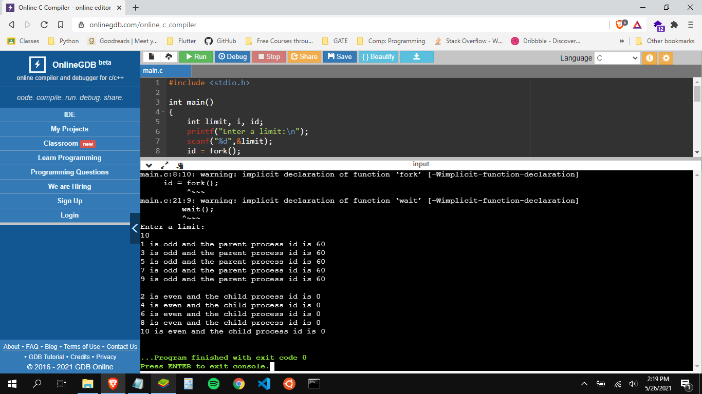
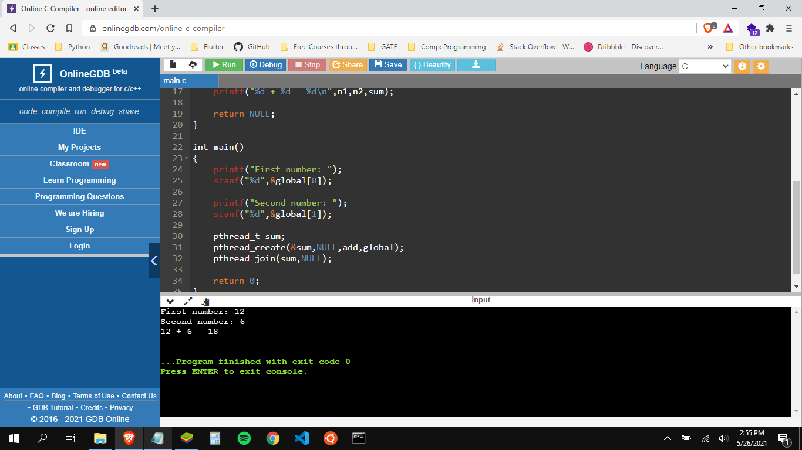
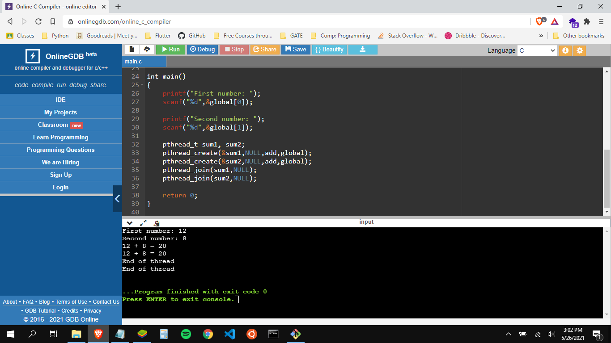

## Cycle - 2 Programs

1. Program to create 2 process one parent process must bring odd numbers up to limit n. At the same ime child process must bring even numbers upto n. Also print the process id.

    [odd-even process](parent-child.c)

    ### output
    

2. Program to create a thread called add, which access two integers from the user and print the sum.

    [add-thread](addthread.c)

    ### output
    

3. Program to create two thread and execute the addition of two numbers parallely in both threads.

    [add-parallel-thread](addparallelthread.c)

    